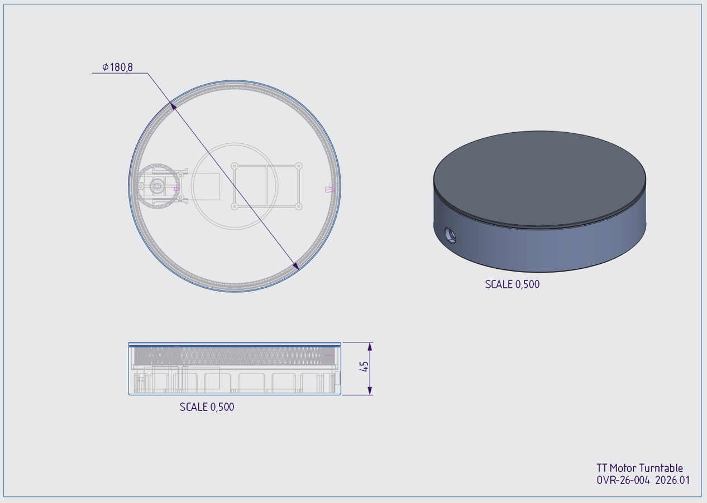

# TT Motor Turntable (ESP32 + 3D Printed)

  

A compact DIY turntable powered by a TT geared motor, a TB6612FNG motor driver and an ESP32 board, with 3D-printable parts and a simple web dashboard for control.

## What’s in this repo
- **Firmware (ESP-IDF):** `firmware/`
- **3D models / CAD:** `hardware/`
- **Docs & guides:** `doc/`

## Features
- WiFi control (web dashboard)
- Speed + direction control
- Configurable pins via ESP-IDF menuconfig

## Quick start
➡️ **Start here:** [Getting Started Guide](doc/getting_started.md)

That guide covers:
- Wiring / pin mapping
- WiFi + pin setup in `idf.py menuconfig`
- Build, flash, and monitor
- Finding the web dashboard address

## Photos / Demos
Control the turntable via the WebDashboard!

  

Displaying a mouse!

  

## Hardware
- STL files: `hardware`
- CAD files: `hardware/cad`

  

## Documentation
- Getting started: [doc/getting_started.md](doc/getting_started.md)

## License
See [LICENSE](LICENSE).