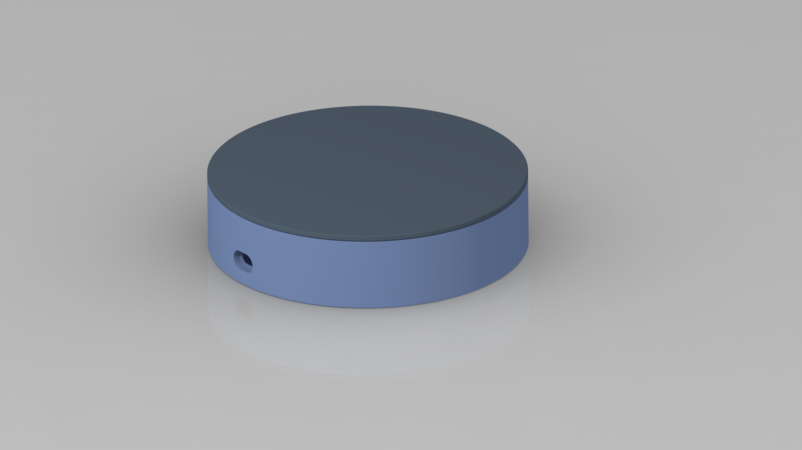
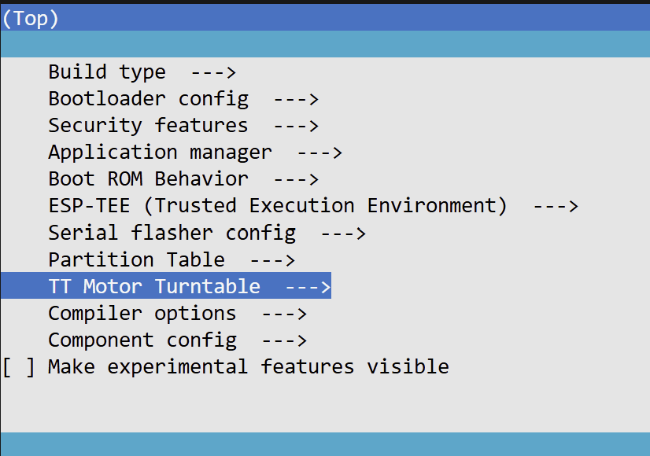
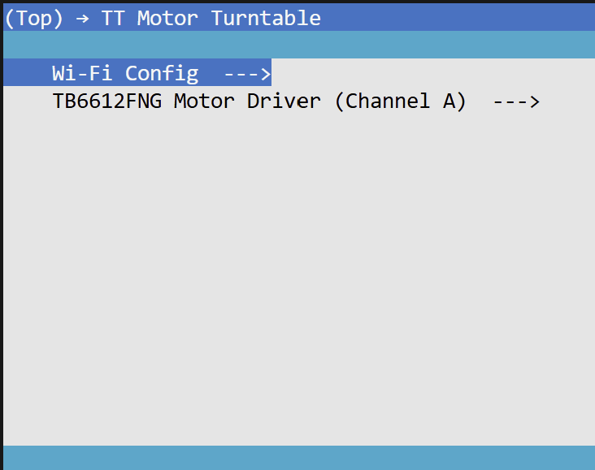
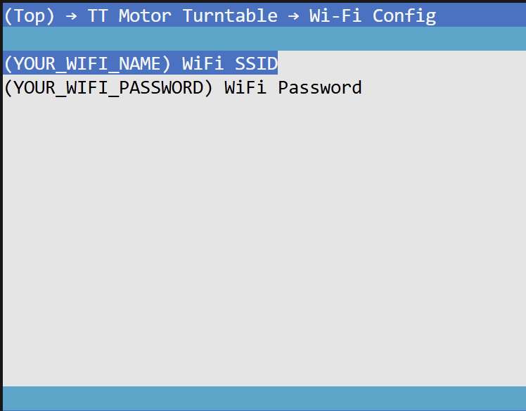
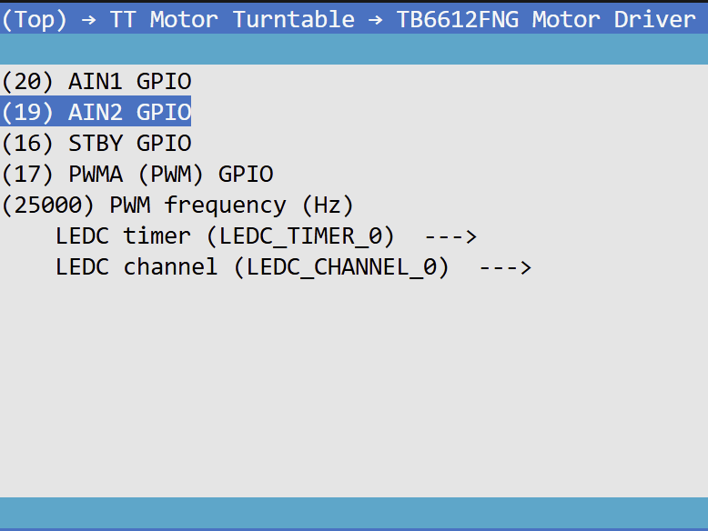
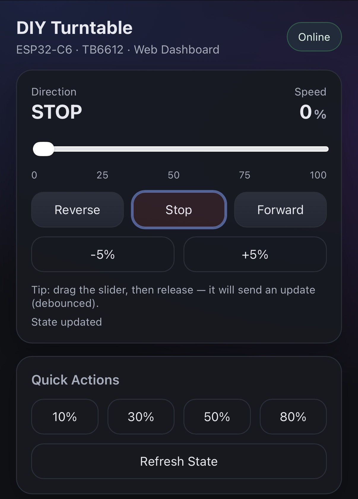

# Getting Started (Build & Flash)

This guide helps you build and flash the DIY Turntable firmware using **ESP-IDF**.

## Repo Structure
- `firmware/` — ESP-IDF project (build / flash)
- `hardware/` — CAD files for 3D printing
- `doc/` — setup guides/ images

---

## 0) Prerequisites

### Hardware
- An ESP32 board (example: ESP32-S3 / ESP32 / ESP32-C3 — **use the one your project supports**)
- USB cable (data-capable)
- Motor driver (TB6612) + motor wired correctly (see wiring guide)
- Stable power supply (insufficient power may cause boot loops)

### Software
- ESP-IDF installed and working (`idf.py` available in your terminal)
- Drivers for your board’s USB-UART chip (if needed)

> If you haven’t installed ESP-IDF yet, follow Espressif’s official instructions for your OS.

---

## 1) Clone the Repo/ Download the .zip files

## 2) You can get the CAD files inside the Hardware folder



## 3) Go to "firmware" folder and open with ESP-IDF environment

## 4) Connection Pinout (Example on XIAO ESP32C6 board, change accordingly to your board)
| Connection Type | TB6612FNG Pin | XIAO ESP32C3 Pin | Description |
|---|---|---|---|
| Power | VM   | 5V (or VBUS)   | Motor power (USB 5V example) |
| Power | VCC  | 3V3            | Logic power (must be 3.3V) |
| Power | GND  | GND            | Common ground |
| Control | STBY | D4 (GPIO16)  | Standby (HIGH to enable) |
| Control | PWMA | D5 (GPIO17)  | PWM speed control |
| Control | AIN2 | D9 (GPIO19)  | Direction input 2 |
| Control | AIN1 | D10 (GPIO20) | Direction input 1 |
| Motor Output | AO1 | —         | Motor terminal 1 |
| Motor Output | AO2 | —         | Motor terminal 2 |

## 5) Run > 'idf.py menuconfig' and setup the WIFI and Driver pins 
TT Motor Turntable config setup in ESP-IDF menuconfig


WIFI and Motor driver pin setup


Replace with your WIFI credentials


Replace with your driver pin to your esp boards



## 6) Run the following commands to build and flash the program

> [!NOTE]
> ```bash
> idf.py set-target esp32s3 (or your preferred board)
> idf.py build
> idf.py -p COMx flash monitor  # Windows: COMx |macOS/Linux: /dev/ttyUSB0
>```

## 7 Check the Debug Console to see the Web Dashboard Address

## 8 Done! Your TT Motor Turntable is ready!
Open web dashboard to control your turntable!



